# QR Code Manager

**Auteur :** Teddy Méré - [teddy-mere.fr](https://teddy-mere.fr) - dev@teddy-mere.fr

## Présentation

**QR Code Manager** est un outil simple et efficace pour créer, gérer et télécharger des QR Codes.
Ce projet est né du constat qu'il n'existait pas de solution facile pour gérer ses QR Codes avec flexibilité et rapidité.

## Fonctionnalités

- Création et gestion illimitée de QR Codes.
- Chaque QR Code peut contenir autant de données que nécessaire.
- Téléchargement des QR Codes aux formats **SVG** et **PNG**.
- Interface intuitive pour visualiser, modifier et organiser vos QR Codes.

## Screenshots / Démonstration

### Connexion

| Light Mode | Dark Mode |
|------------|-----------|
| 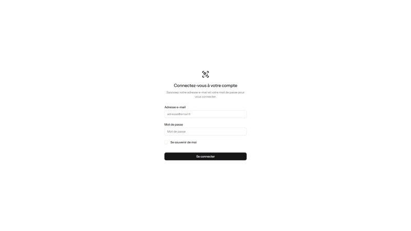 <br> _Écran de connexion_ | 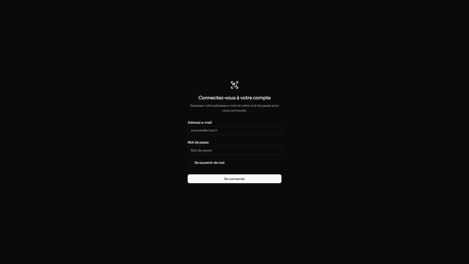 <br> _Écran de connexion_ |

### Tableau de bord

| Light Mode | Dark Mode |
|------------|-----------|
| 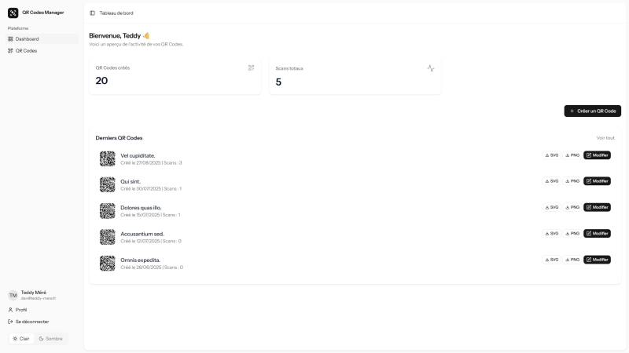 <br> _Dashboard normal_ | 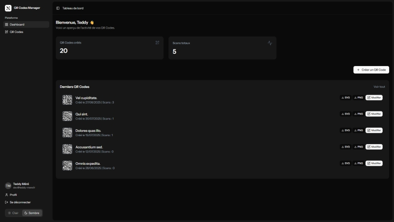 <br> _Dashboard normal_ |

| Light Mode | Dark Mode |
|------------|-----------|
| 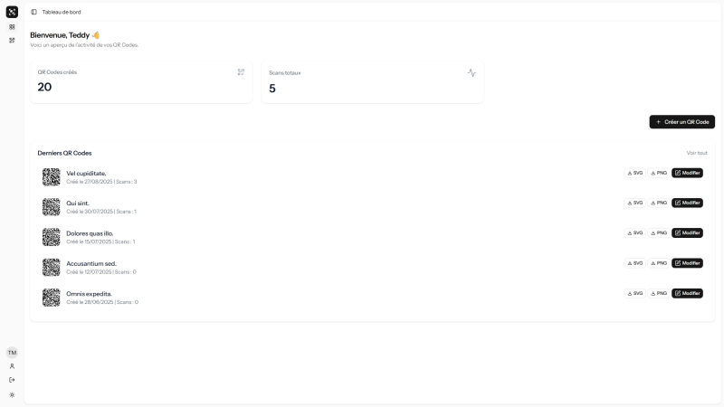 <br> _Dashboard avec barre latérale réduite_ | 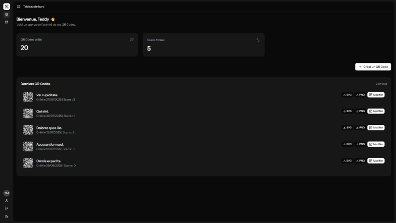 <br> _Dashboard avec barre latérale réduite_ |

### Liste des QR Codes

| Light Mode | Dark Mode |
|------------|-----------|
| 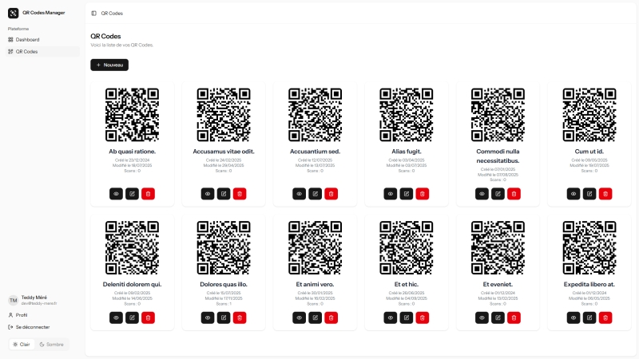 <br> _Liste des QR Codes_ | 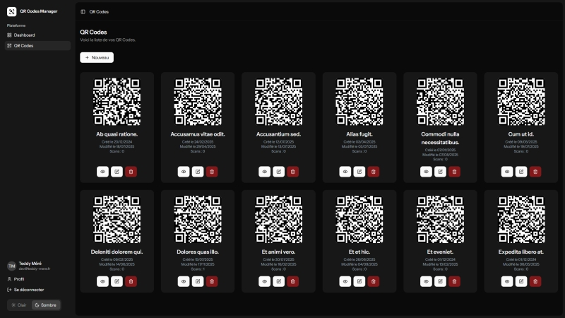 <br> _Liste des QR Codes_ |

| Light Mode | Dark Mode |
|------------|-----------|
| 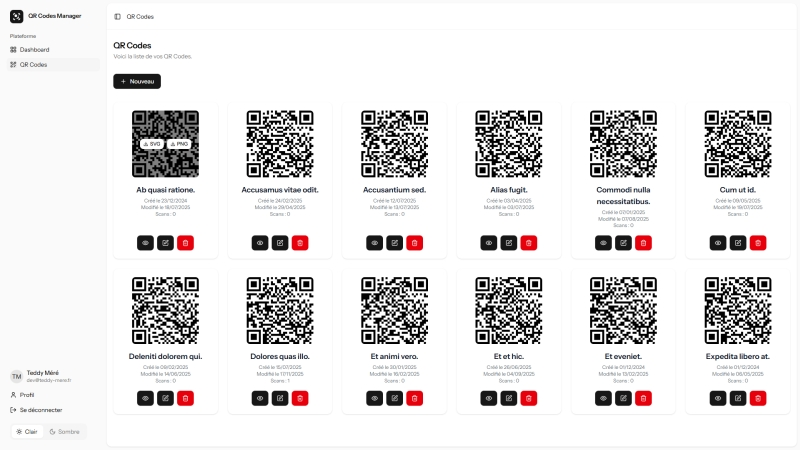 <br> _Liste des QR Codes avec survol_ | 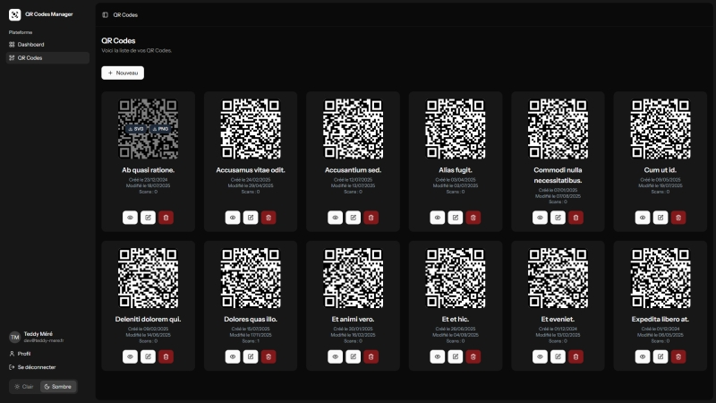 <br> _Liste des QR Codes avec survol_ |

### Ajouter un QR Code

| Light Mode | Dark Mode |
|------------|-----------|
| 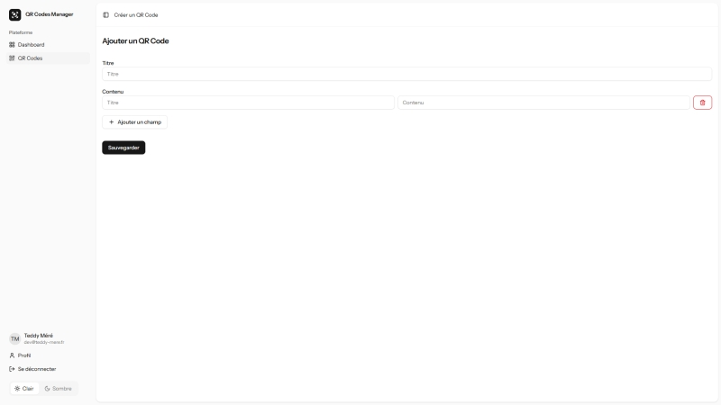 <br> _Formulaire d'ajout d'un QR Code_ | 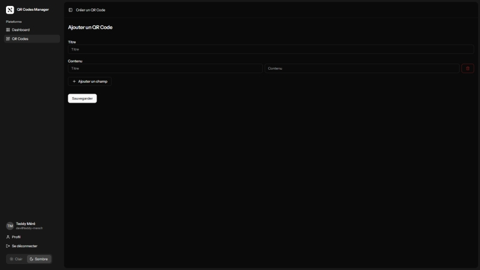 <br> _Formulaire d'ajout d'un QR Code_ |

### Modifier un QR Code

| Light Mode | Dark Mode |
|------------|-----------|
| 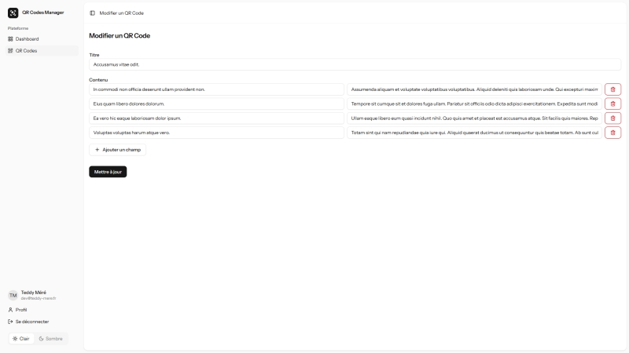 <br> _Édition d'un QR Code_ | 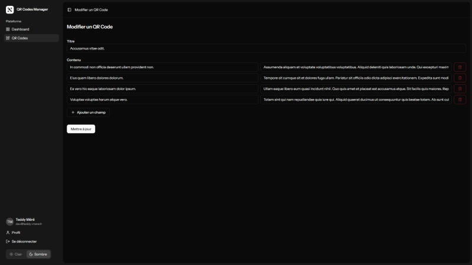 <br> _Édition d'un QR Code_ |

### Profil

| Light Mode | Dark Mode |
|------------|-----------|
| 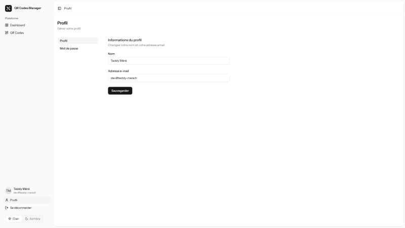 <br> _Infos générales_ | 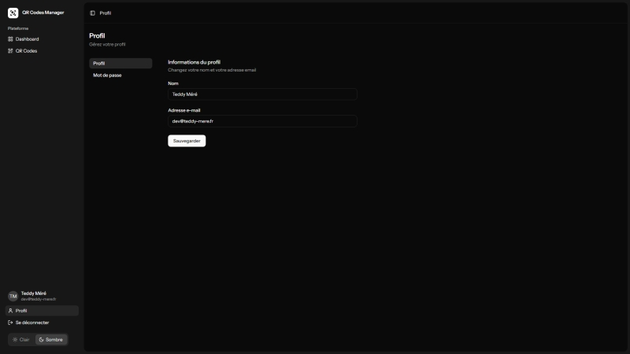 <br> _Infos générales_ |

| Light Mode | Dark Mode |
|------------|-----------|
| 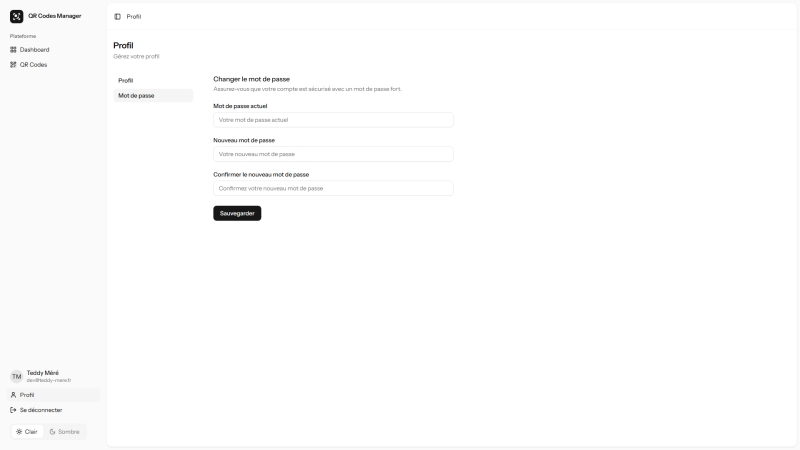 <br> _Changement de mot de passe_ | 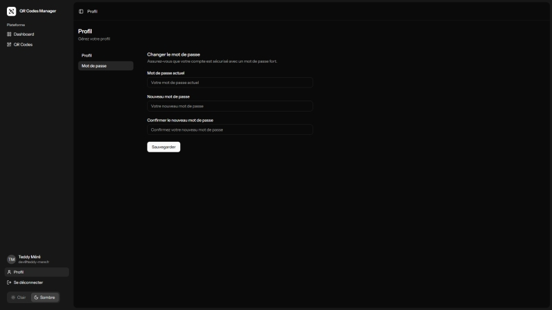 <br> _Changement de mot de passe_ |

### Afficher un QR Code

| Light Mode | Dark Mode |
|------------|-----------|
| 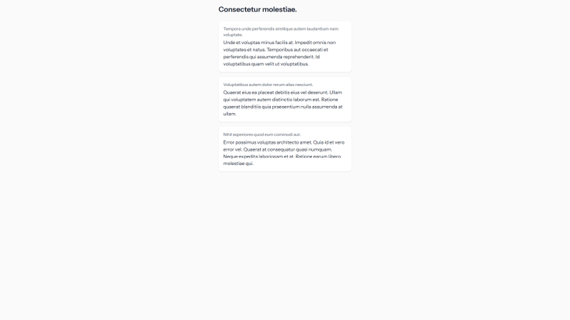 <br> _Page affichée après un scan du QR Code_ | 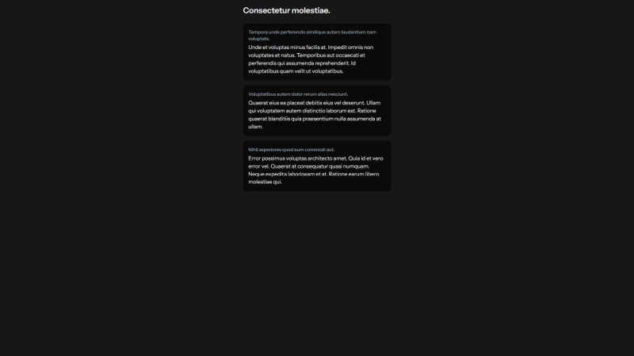 <br> _Page affichée après un scan du QR Code_ |


## Installation en développement

1. Cloner le dépôt :
```
git clone https://github.com/teddy-mere/qr-code-manager.git
cd qr-code-manager
```

2. Lancer la commande de configuration :
```
composer run setup-dev
```

3. Personnaliser le fichier .env (base de données, URL, etc.)

4. Créer un utilisateur :
```
php artisan tinker

# Puis dans la console tinker :
use App\Models\User;
User::create(['name' => 'Admin', 'email' => 'demo@demo.fr', 'password' => bcrypt('demodemo')]);
```
(Optionnel) Injecter des données d'exemple :
```
php artisan db:seed --class=QrCodeSeeder
```
Vous pouvez également générer directement un utilisateur et des données d'exemple en lançant une seule commande :
```
php artisan db:seed
```

5. Lancer le serveur :
```
php artisan serve
```

6. Enjoy !

## Installation en production

1. Cloner le dépôt :
```
git clone https://github.com/teddy-mere/qr-code-manager.git
cd qr-code-manager
```

2. Lancer la commande d'installation :
```
composer run setup-prod
```

3. Modifier le .env pour y saisir la configuration pour la connexion à la base de donnée :
```
DB_CONNECTION=mysql
DB_HOST=127.0.0.1
DB_PORT=3306
DB_DATABASE=qr-code-manager
DB_USERNAME=root
DB_PASSWORD=
```

4. Lancer le script de configuration et suivre les indications :
```
php artisan setup:install
```

5. Configurer Nginx ou Apache sur votre serveur pour pointer sur le dossier `public/`.

6. Enjoy !

## Usage

1. Créez un nouveau QR Code et ajoutez les informations souhaitées.
2. Visualisez, modifiez ou supprimez vos QR Codes existants.
3. Téléchargez le QR Code au format **SVG** ou **PNG** pour l'utiliser où vous le souhaitez.

## Contribution

Les contributions sont les bienvenues !
Pour proposer des améliorations :

1. Forkez le projet.
2. Créez une branche pour votre fonctionnalité :
```
git checkout -b feature/ma-fonctionnalite
```

3. Commitez vos modifications :
```
git commit -m "Ajout de ma fonctionnalité"
```

4. Poussez votre branche et ouvrez une Pull Request.